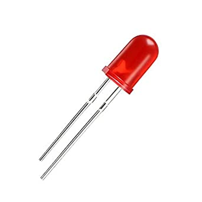

# Water Leakage Detection System

## Problem

In European Union, more than half of the population lives in agglomerations or more than 150,000 population equivalent (PE), generating a daily amount of 41.5 million m3 of wastewater. Besides, an annual portion of 2.4% (counts for 1 billion m3) of treated domestic wastewater discharges contains reusable nutrients, organic carbon, lipids, and biosolids.
For that reason one of the big challenges for the smart cities of the future is to reduce the waste of water in the urban area. If monitoring an entire big water distribution network, find the leaks of water and locate them could be very challenging, monitoring the home wastewater could be easyer.
My water leakage detection system aims to detect a water leak in an office or home environment and notifies the problem to the user. The system is equipped of a buzzer that will signal the malfunctioning of a specific tap also with an acoustic signal.

## Sensors

- ***HC-SR501 Passive Infrared (PIR) Motion Sensor***:    This sensor is used to capture movements near the monitored tap. If there is movement near the tap it sends a positive signal otherwise 0. In our system the PIR is used to understand wether there is someone using the tap or not. The datasheet of the HC-SR501 PIR can be found here: [PIR Datasheet](https://pdf1.alldatasheet.com/datasheet-pdf/view/1131987/ETC2/HC-SR501.html).

- ***Water Flow Sensor***:   This sensor monitor wheter there is water flow exiting from the tap or not. If there is some water flow exiting from the tap it sends a positive signal otherwise it sends 0. The sensor has a small turbine that is activated by the flow. The movement of the turbine actives the magnetic Hall effect sensor, placed near the turbine, that generates the output signal. In our system this sensor is used to understand wether the tap is open or not. 

## Actuators
 

- ***Led***:    Classic led used to notify if the system is on. The led is always on while the system is working.

 

- ***Active Buzzer***:    The active buzzer is turned on when a leakage is dected, in particular the usage of the active buzzer is to use the acoustic signa to keep the attention of someone that can close the tap stopping the leak of water. As soon as the tap is closed the buzzer stops. The datasheet of the active buzzer is available here: [Active Buzzer Datasheet](https://components101.com/sites/default/files/component_datasheet/Buzzer%20Datasheet.pdf).

## System Architecture

In this section we will see the architecture of the entire system starting describing the network structure and its component, how the cloud works and finally we will see how practically connect the hardwares described above.

The network architechture of the system is a chain of elements exchanging messages as described in the image above. In particular the main elements of the architecture are: 

- ***Board Nucleo-F446ZE***: This is the main board of our system that is connected with all the sensors and the actuators. The board collect the sensors data, puts the data in messages and forword the messages to the Mosquitto RSMB broker. To communicate with Mosquitto RSMB, the board subscribes to the topic "topic-out" and sends the data through MQTT-SN. The connection of the board is made possible thanks to the Ethos vistual network interface given by RIOT.
- ***Mosquitto RSMB***: The Really Small Message Broker is a server implementation of the MQTT and MQTT-SN protocols. Since Mosquitto does not support MQTT-SN protocol, the role of Mosquitto RSMB is to forward the incoming MQTT-sn messgaes to Mosquitto through MQTT. In particular it receives messages by the board on topic "topic-in" and send messages to Mosquitto on topic "topic-out". You can find more details about Mosquitto RSMB here: [Mosquitto RSMB Docimentation](https://github.com/eclipse/mosquitto.rsmb)
- ***Mosquitto MQTT Broker***: Mosquitto is a MQTT broker that receives messages from RSMB and forward them to the MQTT broker of AWS. All the messages received by the RSMB are forwarded to the AWS MQTT broker with topic "wl_sensors" with QOS = 1 that guarantees that a message is delivered at least one time to the receiver. The sender stores the message until it gets a PUBACK packet from the receiver that acknowledges receipt of the message. You can find more details about Mosquitto MQTT broker visiting [Mosquitto official page](https://mosquitto.org/)
- ***Amazon Web Services - AWS***:
- ***Front-End***: The front-end is a http web page developed using django framework. The page sends an API request to AWS that returns the 15 most recent data stored in the DynamoDB table. When the data are received they are used to plot a graph showing three lines: one representing the water data, one representing the mouvement data and one for the leak.

*Mettere immagine frontend*

## How the system works

The water leakage system proposed in this work is composed by the main mather board that is an STM32 Nucleo-F44ZE connected with two sensors, a PIR motion sensor and a water flow sensor, and two actuators, one led and one active buzzer. (Refer to [Technology]() document for details)

The two sensors monitor wether there is mouvement near the monitored tap and wether there is a water flow through the tap. If there is some water flow through the tap with no mouvement detected near the tap then the system notyfies a leakage of water. When the leakage of water is detected the buzzer is activated with the goal to draw someone’s attention that can easy solve the problem, for example a faucet left open can be closed easily and quickly by anyone.

In the meanwhile that the system monitors the environment it sends packets containing the collected data to the cloud. Each message sends to the cloud contains information about water flow, mouvement detected and if there is a leak of water. 
These information are written in a JSON format of the following form {"water": int, "mouvement": int, "leak": int} where the water and mouvement field contain the values reported by the sensors and the "leak" field is a binary value set to 1 if there is a leak of water otherwise 0.

## Evaluation

