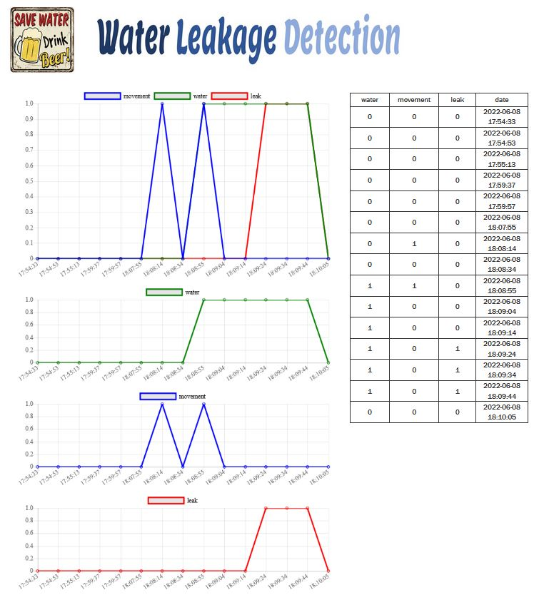

# Water Leakage Detection System

## Problem

In European Union, more than half of the population lives in agglomerations or more than 150,000 population equivalent (PE), generating a daily amount of 41.5 million m3 of wastewater. Besides, an annual portion of 2.4% (counts for 1 billion m3) of treated domestic wastewater discharges contains reusable nutrients, organic carbon, lipids, and biosolids.
For that reason one of the big challenges for the smart cities of the future is to reduce the waste of water in the urban area. If monitoring an entire big water distribution network, find the leaks of water and locate them could be very challenging, monitoring the home wastewater could be easyer.
My water leakage detection system aims to detect a water leak in an office or home environment and notifies the problem to the user. The system is equipped of a buzzer that will signal the malfunctioning of a specific tap also with an acoustic signal.

## Sensors

- ***HC-SR501 Passive Infrared (PIR) Motion Sensor***:  <br/> This sensor is used to capture movements near the monitored tap. If there is movement near the tap it sends a positive signal otherwise 0. In our system the PIR is used to understand wether there is someone using the tap or not. The datasheet of the HC-SR501 PIR can be found here: [PIR Datasheet](https://pdf1.alldatasheet.com/datasheet-pdf/view/1131987/ETC2/HC-SR501.html).

- ***Water Flow Sensor***: <br/> This sensor monitor wheter there is water flow exiting from the tap or not. If there is some water flow exiting from the tap it sends a positive signal otherwise it sends 0. The sensor has a small turbine that is activated by the flow. The movement of the turbine actives the magnetic Hall effect sensor, placed near the turbine, that generates the output signal. In our system this sensor is used to understand wether the tap is open or not. 


## Actuators
<br/>

- ***Led***:  <br/> Classic led used to notify if the system is on. The led is always on while the system is working.

<br/>

- ***Active Buzzer***:  <br/> The active buzzer is turned on when a leakage is dected, in particular the usage of the active buzzer is to use the acoustic signa to keep the attention of someone that can close the tap stopping the leak of water. As soon as the tap is closed the buzzer stops. The datasheet of the active buzzer is available here: [Active Buzzer Datasheet](https://components101.com/sites/default/files/component_datasheet/Buzzer%20Datasheet.pdf).

## System Architecture

In this section we will see the architecture of the entire system starting describing the network structure and its component, how the cloud works and finally we will see how practically connect the hardwares described above.


The network architechture of the system is a chain of elements exchanging messages as described in the image above. In particular the main elements of the architecture are:<br/>

- ***Board Nucleo-F446ZE***: <br/> This is the main board of our system that is connected with all the sensors and the actuators. The board collect the sensors data, puts the data in messages and forword the messages to the Mosquitto RSMB broker. To communicate with Mosquitto RSMB, the board subscribes to the topic "topic-out" and sends the data through MQTT-SN. The connection of the board is made possible thanks to the Ethos vistual network interface given by RIOT.

- ***Mosquitto RSMB***: <br/> The Really Small Message Broker is a server implementation of the MQTT and MQTT-SN protocols. Since Mosquitto does not support MQTT-SN protocol, the role of Mosquitto RSMB is to forward the incoming MQTT-sn messgaes to Mosquitto through MQTT. In particular it receives messages by the board on topic "topic-in" and send messages to Mosquitto on topic "topic-out". You can find more details about Mosquitto RSMB here: [Mosquitto RSMB Docimentation](https://github.com/eclipse/mosquitto.rsmb)

- ***Mosquitto MQTT Broker***: <br/> Mosquitto is a MQTT broker that receives messages from RSMB and forward them to the MQTT broker of AWS. All the messages received by the RSMB are forwarded to the AWS MQTT broker with topic "wl_sensors" with QOS = 1 that guarantees that a message is delivered at least one time to the receiver. The sender stores the message until it gets a PUBACK packet from the receiver that acknowledges receipt of the message. You can find more details about Mosquitto MQTT broker visiting [Mosquitto official page](https://mosquitto.org/)

- ***Amazon Web Services - AWS***: <br/> Regarding the cloud part of our system I decided to develop it using Amazon Web Services (AWS). The role of the cloud in our case is to receive the data collected by the device, store them in a dynamoDB table and make them available to the front-end through REST-API request. The cloud architecture of the system is the following: <br/>  <br/> Lets see in detail how the elements of our cloud architecture work: 

  - **AWS IoT-Core**:   It acts as a MQTT broker receiving the data collected by the board on topic "wl_sensors". Through the execution of a specific rule that sends the incoming data with topic "wl_sensors" to the lambda function "wl-write-lambda". 
  - **AWS DynamoDB**:  It is the database used to store the data collected by the sensors. All the incoming data with topic "wl_sensors" are sent by the IoT-Core to the lambda function "wl-write-lambda" that computes the new id, the timestamp and store the data in the DynamoDB table "wlTable". The table "wlTable" is a table with 3 columns: id, timestamp and sensorsData. The id is the key of the elements while the column sensorsData contains the data collected by the sensors.
  - **AWS API Gateway**:  Is an AWS utility tha allows us to create and deploy a REST API to acces data. In this when the API is requested, the API Gateway invokes the lambda function "wl-api-function" that retrieve the 15 most recent element stored in "wlTable" and sends it back as the response for the API request.
  - **AWS Lambda Functions**:  AWS Lambda allow us to write some functions to manage the data in different ways. In this case we have two lambda functions:
    - wl-write-lambda: This function receives the uincoming data with topic "wl_sensor" that are of the form {"water":int, "movement":int, "leak":int}. The function computes the id to assign to the new data, compute the timestamp corresponding to the arrival time of the data, reads the data and store them in a dynammDB table called "wlTable". 
    - wl-api-function: This function is connected to the API Gateway and in particular it returns the 15 most recent entries of the DynamoDB table "wl_table" where the element are sorted by id. (Highest id = Most recent)
  
  


- ***Front-End***: <br/> The front-end is a http web page developed using django framework. The page sends an API request to AWS that returns the 15 most recent data stored in the DynamoDB table. When the data are received they are used to plot a graph showing three lines: one representing the water data, one representing the mouvement data and one for the leak. The page shows also three more plots each dedicated to water, movement and leak data in order to have a more clear view of waht is going on.  <br/>


- ***Circuit Architecture***: <br/> The circuit model is the following: <br/>  <br/> 
  - The bread board is connected with the ground pin of the board and with the 5V pin of the board, then all the sensors and the actuator are fed with 5V. 
  - We put a resistor of 220Ohm in series with the led. They are connected directly to the 5V line. 
  - The active buzzer is connecte to the pin D2 of our board and it is activated in case of leak.
  - The water flow sensor and the PIR are conncted to A0 and A1 respectively. Both A0 and A1 are adc input pins. <br/> 
  
 The board Nucleo-F446ZE the adc pins are not activated by default so we need to modify Makefile.features and periph_conf.h that we find under RIOT/boards/nucleo-f446ze.
 In particular we need to add to RIOT/boards/nucleo-f446ze/Makefile.features the line
 ```
FEATURES_PROVIDED += periph_adc
```
And then we also need to add to RIOT/boards/nucleo-f446ze/periph_conf.h the following lines:
 ```
/**
 * @name   ADC configuration
 *
 * Note that we do not configure all ADC channels.
 * Instead, wejust define 6 ADC channels, for the Nucleo
 * Arduino header pins A0-A5 and the internal VBAT channel.
 *
 * @{
 */
static const adc_conf_t adc_config[] = {
    {GPIO_PIN(PORT_A, 3), 0, 3},
    {GPIO_PIN(PORT_C, 0), 0, 10},
    {GPIO_PIN(PORT_C, 3), 0, 13},
    {GPIO_PIN(PORT_F, 3), 0, 9},
    {GPIO_PIN(PORT_F, 5), 0, 15},
    {GPIO_PIN(PORT_F, 10), 0, 8},
    {GPIO_UNDEF, 0, 18}, /* VBAT */
};

#define VBAT_ADC            ADC_LINE(6) /**< VBAT ADC line */
#define ADC_NUMOF           ARRAY_SIZE(adc_config)
/** @} */
```

At this point we have configured the pins of our board correspondant to the arduino layout pins A0-A5. 


## Practical Test

After connecting all the components as shown above we need to run our virtual environment:
- Setup of the virtual networks using the RIOT tapsetup interfaces
- Start our MQTT-SN/MQTT transparent bridge that establish a connection with AWS
- Start Mosquitto RSMB that that establish a connection with the transparent bridge

Then we need to deploy our main program, after flashing it to the Nucleo board we have to:
- Set a global IPv6 address for the board
- Connect the board to Mosquitto RSMB
- Start the main program by executing the command "run"

All the detail about the virtual deployment of our system are available in the [code section](https://github.com/FrancescoCrino/water-leakage-detection-system/tree/main/code).

When the system start the led is immediately powered on and the sensor start collecting data. While there is no water flow coming out from the tap the system sample each 20 seconds, when there some water flow detected the system starts sampling each 10 seconds. If there is some water flow detected without any movement the system detects a possible leak. After two possible leak the system notify a leak and the buzz launch the acoustic signal. In order to stop the acoustic signal and reset the system it is required to close the tap.

N.B., Each time the PIR detect a movement it sends a positive signal for many seconds (depends on the regualtion) but after the HIGH period it sends a LOW signal for 3 seconds and motion is not detected. In order to be sure that there is no movement, when the system reads a 0 on the motion pin it performs another read after 3 seconds, if this new read is 0 then there is no movement otherwise the first read was a false negative.
The following image shows an example to better understand how the PIR works.


Each time the system sample the sensors data it send the collected data to AWS and the data are stored in a dynamoDB table.
The user can access to the web page that shows the 15 most recent data stored on the cloud.

Further instruction of how deploying the front-end locally are available here: [front-end section](https://github.com/FrancescoCrino/water-leakage-detection-system/tree/main/FrontEnd)

Finally a video showing how to deploy the virtual environment, how to start the system and how the system work is available here: [Prototype video](https://youtu.be/lUWytAzB21o)

## Network Performances

In the network there are only uplink messages (nucleo board -> aws) containing information about the data collected by the sensors that are stored in aws dynamoDB. <br/>

The nucleo board collects the sensors data and sends them in a payload of the shape '{"water":int, "movement":int, "leak":int}'. That kind of payload has a length of 36 bytes. <br/>

In order to measure the delay from when the nucleo board sends the data to when they are stored in the dynamoDB table we need to the time when the mosquitto rsmb receives the publish request and the timestamp of the new entry in the dynamoDB table. Considering these parameters we have a delay nucleo->dynamoDB that is less then 1 secoond.

With regard to the front-end part we can inspect the webapage to have some information about its performances. I have used the built in inspection console of Firefox and I have that for the first opening of the webpage (no chache) it needs about 1 second to get the data calling the API, while if refreshing the page it needs about 600ms to retireve the data. <br/>

Finally we can hestimate the global delay nucleo->front-end to be less than 2 seconds and this latency is short enough to guarantee a good usability of the system.


